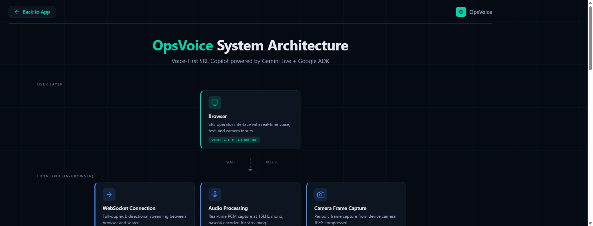

# OpsVoice -- Voice-First SRE Command Center

> **Live App**: [opsvoice-942622207688.us-central1.run.app](https://opsvoice-942622207688.us-central1.run.app/)
> **Demo Video**: [Watch on YouTube](https://youtu.be/lmyWZWknFn0)
> **Architecture**: [Interactive Diagram](https://opsvoice-942622207688.us-central1.run.app/static/architecture.html) | [Presentation Slides](https://opsvoice-942622207688.us-central1.run.app/static/opsvoice-video-slides.html)

## Overview

OpsVoice is a real-time, voice-first SRE (Site Reliability Engineering) copilot that helps on-call engineers diagnose, triage, and respond to production incidents using natural voice conversation, text, and visual inputs. Built with Google's **Gemini 2.5 Flash native audio model** and the **Agent Development Kit (ADK)**, OpsVoice breaks the "text box paradigm" by enabling hands-free incident response through bidirectional audio streaming.

**Built for the [Gemini Live Agent Challenge](https://geminiliveagentchallenge.devpost.com/) hackathon.**

## Category

**Live Agents** -- Real-time audio/vision interaction with natural interruption handling

## Key Features

| Feature | Description |
|---------|-------------|
| Voice-First Interaction | Bidirectional streaming with Gemini 2.5 Flash native audio -- sub-second latency |
| Proactive Alerting | Agent detects service degradation and speaks alerts before you ask |
| Natural Interruption | Barge-in support -- speak while the agent is talking |
| Vision & Screenshots | Camera feed and drag-and-drop screenshot analysis (e.g., Grafana dashboards) |
| Incident Management | Create, update, and resolve incidents entirely via voice |
| Runbook Retrieval | Context-aware remediation steps with tool chaining |
| Google Search Grounding | Real-time search for unfamiliar errors, CVEs, and outage reports |
| Adaptive VAD | Voice Activity Detection with noise floor estimation across environments |
| Live Health Dashboard | Real-time service health monitoring with evolving simulation |
| Auto-Reconnect | WebSocket reconnection with exponential backoff (up to 8 attempts) |

## Architecture



See the [interactive architecture diagram](https://opsvoice-942622207688.us-central1.run.app/static/architecture.html) for an animated view with data flow paths.

```
Browser (Voice / Text / Camera)
    | WebSocket (bidirectional)
FastAPI Backend (Google Cloud Run)
    | Google ADK Runner + LiveRequestQueue
Gemini 2.5 Flash Native Audio (Live API)
    | Tool Calls
+--------------------------------------+
|  check_service_health                |
|  create_incident                     |
|  get_open_incidents                  |
|  update_incident_status              |
|  get_runbook                         |
|  google_search (grounding)           |
+--------------------------------------+
    | Persistence
Google Cloud Firestore
```

## Tech Stack

| Layer | Technology |
|-------|-----------|
| **AI Model** | Gemini 2.5 Flash Native Audio (`gemini-2.5-flash-native-audio-preview`) |
| **Agent Framework** | Google Agent Development Kit (ADK) with LiveRequestQueue |
| **Backend** | Python 3.12, FastAPI, Uvicorn (async) |
| **Frontend** | Vanilla JS, Web Audio API, AudioWorklet, Canvas waveform |
| **Cloud** | Google Cloud Run, Firestore, Secret Manager, Cloud Build, Artifact Registry |
| **Infrastructure** | Docker, Terraform, automated deployment via `deploy-gcp.ps1` |

## Google Cloud Services Used

| Service | Purpose |
|---------|---------|
| Cloud Run | Serverless container hosting with WebSocket support (3600s timeout, 0-2 auto-scaling) |
| Firestore | Persistent incident storage (Native mode, us-central1) |
| Secret Manager | Secure Gemini API key storage |
| Artifact Registry | Docker image repository |
| Cloud Build | Container image builds |
| Cloud Logging | Application observability and structured logs |
| IAM | Dedicated service account with least-privilege roles |

## Quick Start

### Prerequisites

- Python 3.12+
- Google Cloud project with billing enabled
- Gemini API key ([get one at AI Studio](https://aistudio.google.com))
- Docker (for deployment)
- Terraform 1.6+ (for infrastructure provisioning)

### Local Development

```bash
# 1. Clone the repository
git clone https://github.com/reachtokarthikr/OpsVoice.git
cd OpsVoice

# 2. Create virtual environment and install dependencies
python -m venv .venv
.venv\Scripts\activate        # Windows
pip install -r requirements.txt

# 3. Configure environment
cp .env.example .env
# Edit .env and add your GOOGLE_API_KEY and GOOGLE_CLOUD_PROJECT

# 4. Run the application
python -m app.frontend

# 5. Open http://localhost:7860 in your browser
```

### Deploy to Google Cloud

**Option 1: One-Click Script (Recommended)**
```powershell
./deploy-gcp.ps1
```
Builds the Docker image via Cloud Build, pushes to Artifact Registry, deploys to Cloud Run, and verifies with a health check.

**Option 2: Step by Step**
```bash
# Provision infrastructure
cd terraform && terraform init && terraform apply

# Build and deploy
gcloud builds submit --tag us-central1-docker.pkg.dev/PROJECT_ID/opsvoice/opsvoice:latest .
gcloud run deploy opsvoice --region us-central1 \
  --image us-central1-docker.pkg.dev/PROJECT_ID/opsvoice/opsvoice:latest \
  --allow-unauthenticated
```

## Demo Scenarios

### 1. Voice-Driven Incident Triage
> "Hey OpsVoice, what's the status of inventory-db?"
> Agent checks health, reports critical status, suggests runbook

### 2. Proactive Alert Response
> Wait 45 seconds after connecting -- agent proactively alerts about notification-worker going critical
> "Create a P1 incident for that" -- agent creates incident via voice

### 3. Screenshot Analysis
> Drop a Grafana dashboard screenshot -- agent analyzes the image and correlates with service health data

### 4. Natural Interruption
> Speak while the agent is talking -- it stops, listens, and pivots to your new question

### 5. Multi-Service Cascade
> "Check all services" -- agent reports on all 6 services, identifies cascade from inventory-db to payment-api

## Project Structure

```
OpsVoice/
├── app/
│   ├── main.py                    # FastAPI server, WebSocket, alert broadcasting
│   ├── frontend.py                # Local development launcher
│   └── opsvoice_agent/
│       ├── agent.py               # Gemini agent definition & system prompt
│       └── tools.py               # 6 SRE tools, health simulation, incident management
├── static/
│   ├── index.html                 # SRE Command Center UI (three-panel layout)
│   ├── style.css                  # Dark theme design system with gradients
│   ├── script.js                  # Client logic: audio, WebSocket, VAD, camera, UI
│   ├── mic-processor.js           # AudioWorklet for 16kHz PCM downsampling
│   ├── architecture.html          # Interactive architecture diagram
│   └── opsvoice-video-slides.html # Presentation slides
├── terraform/                     # Infrastructure as Code (Cloud Run, Firestore, IAM, etc.)
├── docs/                          # Documentation, architecture, security, presentation
├── Dockerfile                     # Multi-stage Python 3.12-slim build
├── deploy-gcp.ps1                 # One-click GCP deployment
├── requirements.txt               # Python dependencies (6 packages)
└── README.md
```

## Security

OpsVoice follows security best practices for a cloud-native application:

- API keys stored in **Google Cloud Secret Manager** (never in code or images)
- **Least-privilege IAM** with a dedicated service account
- Non-root Docker container with multi-stage build
- Input validation, rate limiting (60 msg/sec), and size limits on all endpoints
- HTTPS/WSS encryption via Cloud Run
- Audio and video streams are never persisted
- No PII stored

See [docs/SECURITY.md](docs/SECURITY.md) for the full security practices document.

## Documentation

| Document | Description |
|----------|-------------|
| [Architecture](docs/ARCHITECTURE.md) | System design, data flow, and design decisions |
| [API Reference](docs/API_REFERENCE.md) | HTTP and WebSocket endpoint documentation |
| [Setup Guide](docs/SETUP_GUIDE.md) | Local development to Cloud Run deployment |
| [Security](docs/SECURITY.md) | Security practices and checklist |
| [Contributing](docs/CONTRIBUTING.md) | Development standards and pull request checklist |
| [Blog Post](https://medium.com/@reachtokarthikr/how-i-built-opsvoice-for-the-gemini-live-agent-challenge-f118cacb23a8) | How I built OpsVoice |

## What I Learned

- Gemini's native audio model enables remarkably natural voice interactions with sub-second latency
- Google ADK simplifies building agents with tool calling and bidirectional streaming
- Voice Activity Detection (VAD) is crucial for good UX -- adaptive thresholds beat fixed ones
- Proactive agent behavior (pushing alerts vs. waiting for queries) dramatically changes the user experience
- WebSocket-based architecture is essential for real-time audio streaming to Cloud Run

## License

MIT

---

Built by [Karthik](https://github.com/reachtokarthikr) for the [Gemini Live Agent Challenge](https://geminiliveagentchallenge.devpost.com/) hackathon.
